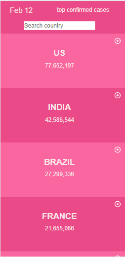
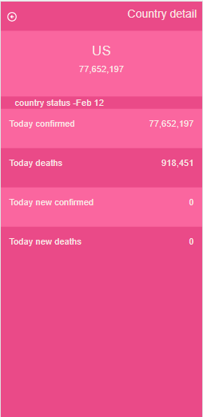
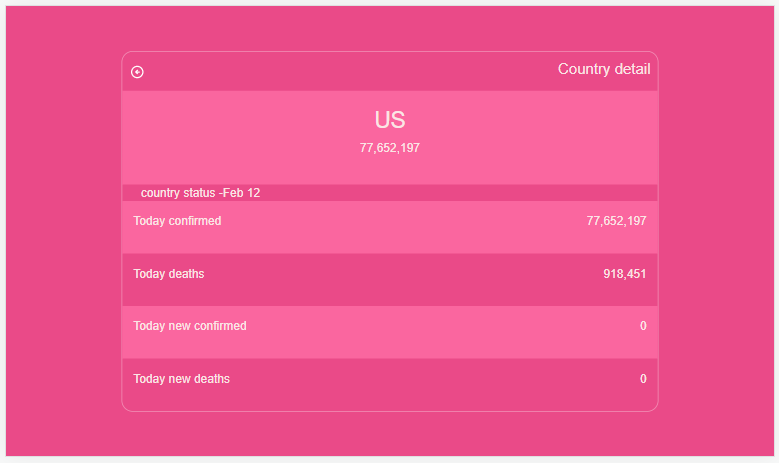
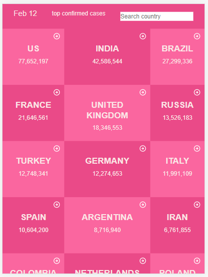

# React-redux-capstone

> This is a single page react application built around Narrative API with daily COVID data. It enables users to get information about the COVID situation in different areas around the world. Once the app is opened, users are presented with a homepage with COVID distribution among countries from hightst to lowest on that particular date. Users can also use the search bar to search for a specific country.

>    

## Loom Video
[Video presentation](https://www.loom.com/share/8e5caa6e137a4943aa86a5645fd23e18)

## Live Demo
[Live demo on Netlify](https://vigilant-haibt-fecc8e.netlify.app/)

## Languages

- HTML/CSS
- JavaScript

## Technologies

- React Bootstrap
- React
- Redux

## Getting Started

To get a local copy up and running follow these simple example steps.

### Setup

1.  Open a terminal, navigate to the directory that you would like to clone the repository into using commands like:
    - `cd /pathname` to change your working directory.
2.  Next, clone the remote repository and create a local copy on your machine using this command:
    - `git clone https://github.com/Fikerte-T/react-redux-capstone2`
3.  Now you can see the contents of the remote repository on your machine by moving into the newly cloned directory:
    - `react-redux-capstone2`
    - `ls -la`
4.  run `npm install` on the command line to download all dependency packages.

### Run

1. run `npm run build` Builds the app for production to the `build` folder.\.
2. run `npm start` to start the application in production mode.

## Author

👤 **Fikerte Tesfaye**

- GitHub: [@Fikerte-T](https://github.com/Fikerte-T)
- Twitter: [@tofikertesfaye](https://twitter.com/tofikertesfaye)
- LinkedIn: [LinkedIn](https://www.linkedin.com/in/fikerte-tesfaye-a68337216/)

## Show your support

Give a ⭐️ if you like this project!

## Acknowledgments

- Original design idea by [Nelson Sakwa on Behance](https://www.behance.net/sakwadesignstudio) under the [Creative Commons License](https://creativecommons.org/licenses/by-nc/4.0/)
